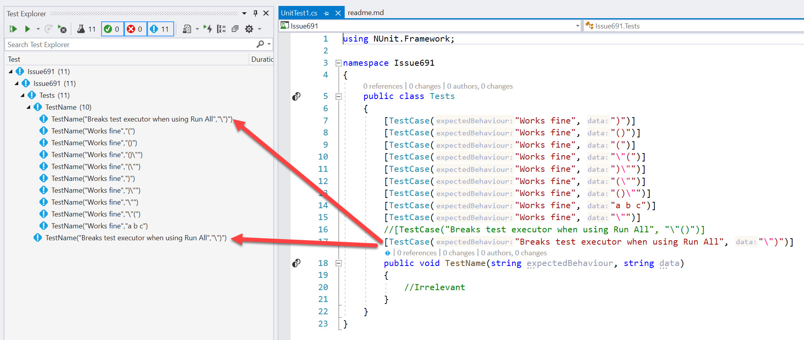
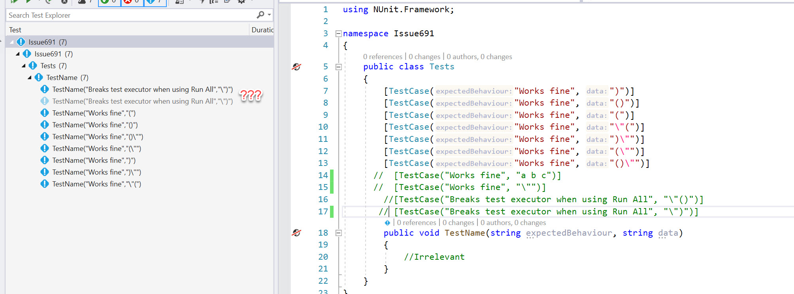
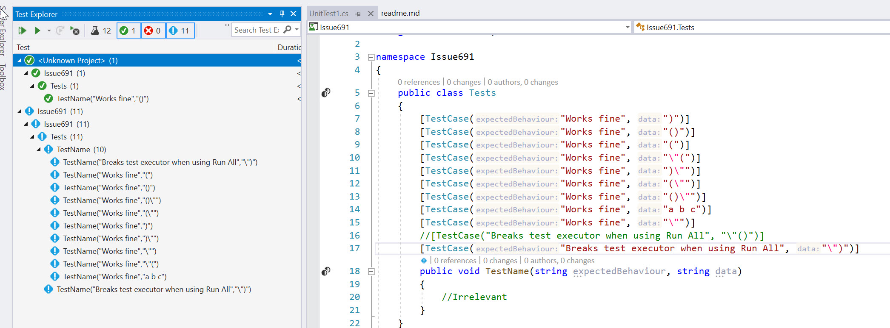

###  Issue 691

See the [issue here](https://github.com/nunit/nunit3-vs-adapter/issues/691)

Just after loading the solution:



Trying to run all breaks the execution:

```
[1/9/2020 4:00:26.822 PM] NUnit Adapter 3.16.0.0: Test execution started
[1/9/2020 4:00:26.846 PM] UpdateSummary Detail Unchanged: SKIPPED
[1/9/2020 4:00:26.846 PM] An exception occurred while invoking executor 'executor://nunit3testexecutor/': Incorrect format for TestCaseFilter Error: Missing '('. Specify the correct format and try again. Note that the incorrect format can lead to no test getting executed.
[1/9/2020 4:00:27.002 PM] ========== Run finished: 0 tests run (0:00:00.6416213) ==========
```

Now, let me comment out some lines, build again:



And now the testcases that are "out" are still in the Test Explorer, one sort of found, the other... not...


And the crash is the duplicate key issue:
```
[1/9/2020 4:07:24.111 PM] System.Collections.Generic.KeyNotFoundException: Unable to find UniqueTest VSTestAdapter,D:\repos\NUnit\nunit3-vs-adapter.issues\Issue691\Issue691\Issue691\bin\Debug\netcoreapp3.1\Issue691.dll,Issue691.Tests.TestName,:371e1e87-d687-8c88-e619-757610d92ec8
   at Microsoft.VisualStudio.TestStorage.TestStoreHierarchyNode.LookupUniqueTest(MergedTestIndex index)
   at Microsoft.VisualStudio.TestStorage.TestStoreHierarchyIndex.<>c__DisplayClass41_0.<GetTestContainersForNodes>b__0(TestStoreHierarchyNode ct)
   at System.Linq.Enumerable.WhereSelectEnumerableIterator`2.MoveNext()
   at Microsoft.VisualStudio.TestStorage.TestStore.UpdateContainerConfigs(IDictionary`2 allContainerConfigs, IEnumerable`1 containers, CancellationToken cancellationToken)
   at Microsoft.VisualStudio.TestStorage.TestStore.GetTestContainersForNodes(Int32 viewId, IEnumerable`1 nodeIds, CancellationToken cancellationToken)
   at Microsoft.VisualStudio.TestWindow.Host.TestWindowStoreService.<>c__DisplayClass34_0.<GetTestSourcesAsync>b__0()
   at Microsoft.VisualStudio.TestWindow.Extensibility.ILoggerExtensions.<CallWithCatchAsync>d__10`1.MoveNext()
--- End of stack trace from previous location where exception was thrown ---
   at System.Runtime.ExceptionServices.ExceptionDispatchInfo.Throw()
   at Microsoft.VisualStudio.Telemetry.WindowsErrorReporting.WatsonReport.GetClrWatsonExceptionInfo(Exception exceptionObject)
```

Restarting Visual Studio brings back the "Unknown Project"



I have also seen behaviour where just commenting out line 14 (!) removed the duplicated "Breaks tests..:" cases.  But hard to reproduce, it is not consistent.


