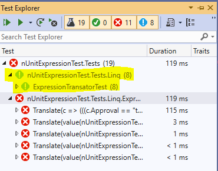
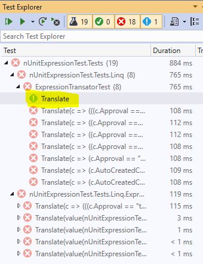

# nUnitExpressionTest
This repository shows nUnit's failure to properly run certain tests. Test
failures are expected as the tested items are not fully implemented. The
problem is the "not run" tests. If "Run All" is selected, the nUnit will run no
tests. If you run tests selectively you can get them to run individually. Noted
below is an example output log from running the tests in Visual Studio. The
images and log message are from:

(Note:  This repo originates from John Jaylward https://github.com/johnjaylward/nUnitExpressionTest.git) )


```
Microsoft Visual Studio Professional 2019
Version 16.2.5
VisualStudio.16.Release/16.2.5+29306.81
Microsoft .NET Framework
Version 4.8.03761

Installed Version: Professional

Visual C++ 2019   00435-60000-00000-AA694
Microsoft Visual C++ 2019

ADL Tools Service Provider   1.0
This package contains services used by Data Lake tools

Application Insights Tools for Visual Studio Package   9.1.00611.1
Application Insights Tools for Visual Studio

ASP.NET and Web Tools 2019   16.2.292.25104
ASP.NET and Web Tools 2019

ASP.NET Web Frameworks and Tools 2012   16.2.292.25104
For additional information, visit https://www.asp.net/

ASP.NET Web Frameworks and Tools 2019   16.2.292.25104
For additional information, visit https://www.asp.net/

Azure App Service Tools v3.0.0   16.2.292.25104
Azure App Service Tools v3.0.0

Azure Data Lake Node   1.0
This package contains the Data Lake integration nodes for Server Explorer.

Azure Data Lake Tools for Visual Studio   2.4.1000.0
Microsoft Azure Data Lake Tools for Visual Studio

Azure Functions and Web Jobs Tools   16.2.292.25104
Azure Functions and Web Jobs Tools

Azure Stream Analytics Tools for Visual Studio   2.4.1000.0
Microsoft Azure Stream Analytics Tools for Visual Studio

C# Tools   3.2.1-beta4-19408-03+2fc6a04980f800c59e8ede97e6ae294ff47d666e
C# components used in the IDE. Depending on your project type and settings, a different version of the compiler may be used.

Common Azure Tools   1.10
Provides common services for use by Azure Mobile Services and Microsoft Azure Tools.

Cookiecutter   16.2.19178.1
Provides tools for finding, instantiating and customizing templates in cookiecutter format.

GitHub.VisualStudio   2.9.1.7781
A Visual Studio Extension that brings the GitHub Flow into Visual Studio.

GitLab Extension for Visual Studio   1.0.189
A Visual Studio Extension that brings the GitLab Flow into Visual Studio.

IntelliCode Extension   1.0
IntelliCode Visual Studio Extension Detailed Info

Microsoft Azure HDInsight Azure Node   2.4.1000.0
HDInsight Node under Azure Node

Microsoft Azure Hive Query Language Service   2.4.1000.0
Language service for Hive query

Microsoft Azure Stream Analytics Language Service   2.4.1000.0
Language service for Azure Stream Analytics

Microsoft Azure Stream Analytics Node   1.0
Azure Stream Analytics Node under Azure Node

Microsoft Azure Tools   2.9
Microsoft Azure Tools for Microsoft Visual Studio 0x10 - v2.9.20626.2

Microsoft Continuous Delivery Tools for Visual Studio   0.4
Simplifying the configuration of Azure DevOps pipelines from within the Visual Studio IDE.

Microsoft JVM Debugger   1.0
Provides support for connecting the Visual Studio debugger to JDWP compatible Java Virtual Machines

Microsoft Library Manager   1.0
Install client-side libraries easily to any web project

Microsoft MI-Based Debugger   1.0
Provides support for connecting Visual Studio to MI compatible debuggers

Microsoft Visual C++ Wizards   1.0
Microsoft Visual C++ Wizards

Microsoft Visual Studio Tools for Containers   1.1
Develop, run, validate your ASP.NET Core applications in the target environment. F5 your application directly into a container with debugging, or CTRL + F5 to edit & refresh your app without having to rebuild the container.

Microsoft Visual Studio VC Package   1.0
Microsoft Visual Studio VC Package

NuGet Package Manager   5.2.0
NuGet Package Manager in Visual Studio. For more information about NuGet, visit https://docs.nuget.org/

Office Developer Tools for Visual Studio   16.0.28818.01
Microsoft Office Developer Tools for Visual Studio

ProjectServicesPackage Extension   1.0
ProjectServicesPackage Visual Studio Extension Detailed Info

Python   16.2.19178.1
Provides IntelliSense, projects, templates, debugging, interactive windows, and other support for Python developers.

Python - Conda support   16.2.19178.1
Conda support for Python projects.

Python - Django support   16.2.19178.1
Provides templates and integration for the Django web framework.

Python - IronPython support   16.2.19178.1
Provides templates and integration for IronPython-based projects.

Python - Profiling support   16.2.19178.1
Profiling support for Python projects.

ResourcePackage Extension   1.0
ResourcePackage Visual Studio Extension Detailed Info

ResourcePackage Extension   1.0
ResourcePackage Visual Studio Extension Detailed Info

SQL Server Data Tools   16.0.61906.28070
Microsoft SQL Server Data Tools

Test Adapter for Boost.Test   1.0
Enables Visual Studio's testing tools with unit tests written for Boost.Test.  The use terms and Third Party Notices are available in the extension installation directory.

ToolWindowHostedEditor   1.0
Hosting json editor into a tool window

TypeScript Tools   16.0.10627.2001
TypeScript Tools for Microsoft Visual Studio

Visual Basic Tools   3.2.1-beta4-19408-03+2fc6a04980f800c59e8ede97e6ae294ff47d666e
Visual Basic components used in the IDE. Depending on your project type and settings, a different version of the compiler may be used.

Visual C++ for Linux Development   1.0.9.29110
Visual C++ for Linux Development

Visual F# Tools 10.4 for F# 4.6   16.2.0-beta.19321.1+a24d94ecf97d0d69d4fbe6b8b10cd1f97737fff4
Microsoft Visual F# Tools 10.4 for F# 4.6

Visual Studio Code Debug Adapter Host Package   1.0
Interop layer for hosting Visual Studio Code debug adapters in Visual Studio

Visual Studio Tools for CMake   1.0
Visual Studio Tools for CMake

Visual Studio Tools for CMake   1.0
Visual Studio Tools for CMake

Visual Studio Tools for Containers   1.0
Visual Studio Tools for Containers

Workflow Manager Tools 1.0   1.0
This package contains the necessary Visual Studio integration components for Workflow Manager.
```






```
[9/17/2019 1:56:03.089 PM Diagnostic] Enqueue operation 'RunSelectedOperation', hashcode:14796038 
[9/17/2019 1:56:03.089 PM Diagnostic] Operation left in the the queue: 1
[9/17/2019 1:56:03.089 PM Diagnostic] 	'RunSelectedOperation', hashcode:14796038
[9/17/2019 1:56:03.089 PM Diagnostic] 

[9/17/2019 1:56:03.089 PM Diagnostic] Operation Dequeue : 'RunSelectedOperation'
[9/17/2019 1:56:03.156 PM Diagnostic] Starting programmatic build of containers... 
[9/17/2019 1:56:03.439 PM Diagnostic] Completed programmatic build of containers.
[9/17/2019 1:56:03.439 PM Diagnostic] TestContainer update (build) complete : 282 ms
[9/17/2019 1:56:03.440 PM Diagnostic] DiscoveryOperation<RunSelectedOperation> FinishedChangedCotainers, changed container count is 1
[9/17/2019 1:56:03.440 PM Diagnostic] Discovering the following containers :
[9/17/2019 1:56:03.440 PM Diagnostic] 	...\nUnitExpressionTest\nUnitExpressionTest.Tests\bin\Debug\net46\nUnitExpressionTest.Tests.dll
[9/17/2019 1:56:03.471 PM Informational] ---------- Discovery started ----------
[9/17/2019 1:56:03.471 PM Diagnostic] TelemetrySession: Creating the event: VS/UnitTest/TestWindow/Ext/RunSettingsService 
[9/17/2019 1:56:03.471 PM Diagnostic] Event:VS/UnitTest/TestWindow/Ext/RunSettingsService key: VS.UnitTest.TestWindow.RunSettingsService.Name value:Python Run Settings
[9/17/2019 1:56:03.472 PM Diagnostic] TelemetrySession: Creating the event: VS/UnitTest/TestWindow/Ext/RunSettingsService 
[9/17/2019 1:56:03.472 PM Diagnostic] Event:VS/UnitTest/TestWindow/Ext/RunSettingsService key: VS.UnitTest.TestWindow.RunSettingsService.Name value:BoostTestInternalSettings
[9/17/2019 1:56:03.472 PM Diagnostic] TelemetrySession: Creating the event: VS/UnitTest/TestWindow/Ext/RunSettingsService 
[9/17/2019 1:56:03.472 PM Diagnostic] Event:VS/UnitTest/TestWindow/Ext/RunSettingsService key: VS.UnitTest.TestWindow.RunSettingsService.Name value:VSTest Run Configuration
[9/17/2019 1:56:03.472 PM Diagnostic] TelemetrySession: Creating the event: VS/UnitTest/TestWindow/Ext/RunSettingsService 
[9/17/2019 1:56:03.472 PM Diagnostic] Event:VS/UnitTest/TestWindow/Ext/RunSettingsService key: VS.UnitTest.TestWindow.RunSettingsService.Name value:TestPropertySettingsForBoostAdapter
[9/17/2019 1:56:03.472 PM Diagnostic] File timestamp remains 9/17/2019 13:39:54 for ...\nUnitExpressionTest\nUnitExpressionTest.Tests\bin\Debug\net46\nUnitExpressionTest.Tests.dll
[9/17/2019 1:56:03.473 PM Informational] ========== Discovery skipped: All test containers are up to date ==========
[9/17/2019 1:56:03.472 PM Diagnostic] TelemetrySession: Creating the event: VS/UnitTest/TestWindow/Ext/RunSettingsService 
[9/17/2019 1:56:03.473 PM Diagnostic] Event:VS/UnitTest/TestWindow/Ext/RunSettingsService key: VS.UnitTest.TestWindow.RunSettingsService.Name value:TestPropertySettingsForGoogleAdapter
[9/17/2019 1:56:03.473 PM Diagnostic] TelemetrySession: Creating the event: VS/UnitTest/TestWindow/Ext/RunSettings 
[9/17/2019 1:56:03.473 PM Diagnostic] Event:VS/UnitTest/TestWindow/Ext/RunSettings key: VS.UnitTest.TestWindow.RunSettings.Services value:5
[9/17/2019 1:56:03.481 PM Informational] ---------- Run started ----------
[9/17/2019 1:56:03.481 PM Diagnostic] TelemetrySession: Creating the event: VS/UnitTest/TestWindow/Ext/RunSettingsService 
[9/17/2019 1:56:03.482 PM Diagnostic] Event:VS/UnitTest/TestWindow/Ext/RunSettingsService key: VS.UnitTest.TestWindow.RunSettingsService.Name value:Python Run Settings
[9/17/2019 1:56:03.482 PM Diagnostic] TelemetrySession: Creating the event: VS/UnitTest/TestWindow/Ext/RunSettingsService 
[9/17/2019 1:56:03.482 PM Diagnostic] Event:VS/UnitTest/TestWindow/Ext/RunSettingsService key: VS.UnitTest.TestWindow.RunSettingsService.Name value:BoostTestInternalSettings
[9/17/2019 1:56:03.482 PM Diagnostic] TelemetrySession: Creating the event: VS/UnitTest/TestWindow/Ext/RunSettingsService 
[9/17/2019 1:56:03.482 PM Diagnostic] Event:VS/UnitTest/TestWindow/Ext/RunSettingsService key: VS.UnitTest.TestWindow.RunSettingsService.Name value:VSTest Run Configuration
[9/17/2019 1:56:03.482 PM Diagnostic] TelemetrySession: Creating the event: VS/UnitTest/TestWindow/Ext/RunSettingsService 
[9/17/2019 1:56:03.482 PM Diagnostic] Event:VS/UnitTest/TestWindow/Ext/RunSettingsService key: VS.UnitTest.TestWindow.RunSettingsService.Name value:TestPropertySettingsForBoostAdapter
[9/17/2019 1:56:03.482 PM Diagnostic] TelemetrySession: Creating the event: VS/UnitTest/TestWindow/Ext/RunSettingsService 
[9/17/2019 1:56:03.482 PM Diagnostic] Event:VS/UnitTest/TestWindow/Ext/RunSettingsService key: VS.UnitTest.TestWindow.RunSettingsService.Name value:TestPropertySettingsForGoogleAdapter
[9/17/2019 1:56:03.483 PM Diagnostic] TelemetrySession: Creating the event: VS/UnitTest/TestWindow/Ext/RunSettings 
[9/17/2019 1:56:03.483 PM Diagnostic] Event:VS/UnitTest/TestWindow/Ext/RunSettings key: VS.UnitTest.TestWindow.RunSettings.Services value:5
[9/17/2019 1:56:03.483 PM Diagnostic] Some tests from the test run selection do not have origin VSTestAdapterDiscovery and will be executed by name.
[9/17/2019 1:56:03.483 PM Diagnostic] Grouped ...\nUnitExpressionTest\nUnitExpressionTest.Tests\bin\Debug\net46\nUnitExpressionTest.Tests.dll : (AnyCPU, Framework45, net46, )
[9/17/2019 1:56:03.485 PM Diagnostic] Tests run settings for ...\nUnitExpressionTest\nUnitExpressionTest.Tests\bin\Debug\net46\nUnitExpressionTest.Tests.dll:
 <RunSettings>
  <Python>
    <TestCases />
  </Python>
  <BoostTestInternalSettings xmlns:xsi="http://www.w3.org/2001/XMLSchema-instance" xmlns:xsd="http://www.w3.org/2001/XMLSchema">
    <VSProcessId>7748</VSProcessId>
  </BoostTestInternalSettings>
  <RunConfiguration>
    <ResultsDirectory>...\nUnitExpressionTest\TestResults</ResultsDirectory>
    <SolutionDirectory>...\nUnitExpressionTest\</SolutionDirectory>
    <TargetPlatform>X86</TargetPlatform>
    <CollectSourceInformation>False</CollectSourceInformation>
  </RunConfiguration>
</RunSettings>.
[9/17/2019 1:56:03.793 PM Diagnostic] UpdateSummary Detail Unchanged: SKIPPED
[9/17/2019 1:56:04.235 PM Diagnostic] UpdateSummary Detail Unchanged: SKIPPED
[9/17/2019 1:56:04.279 PM Informational] NUnit Adapter 3.13.0.0: Test execution started
[9/17/2019 1:56:04.283 PM Error] An exception occurred while invoking executor 'executor://nunit3testexecutor/': Incorrect format for TestCaseFilter Error: Missing '('. Specify the correct format and try again. Note that the incorrect format can lead to no test getting executed.
[9/17/2019 1:56:04.393 PM Diagnostic] Project nUnitExpressionTest.Tests references test adapter: NUnit3TestAdapter, version 3.14.0
[9/17/2019 1:56:04.395 PM Informational] ========== Run finished: 0 tests run (0:00:00.8497518) ==========
[9/17/2019 1:56:04.636 PM Diagnostic] UpdateSummary Detail Unchanged: SKIPPED
[9/17/2019 1:56:05.061 PM Diagnostic] UpdateSummary Detail Unchanged: SKIPPED
```